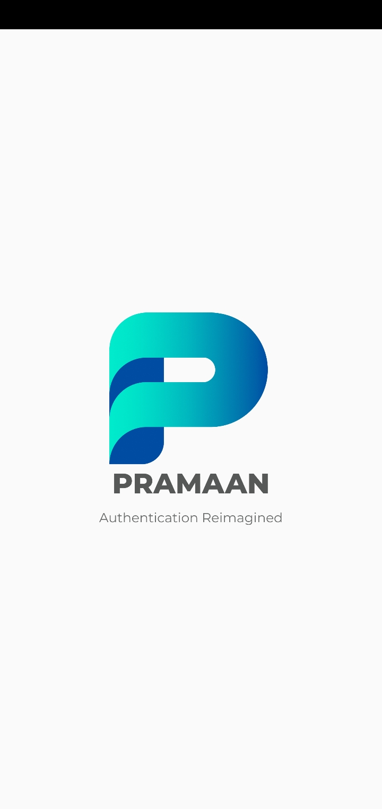
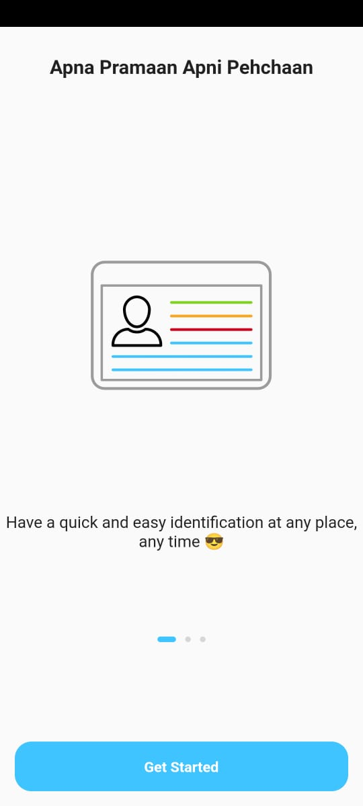
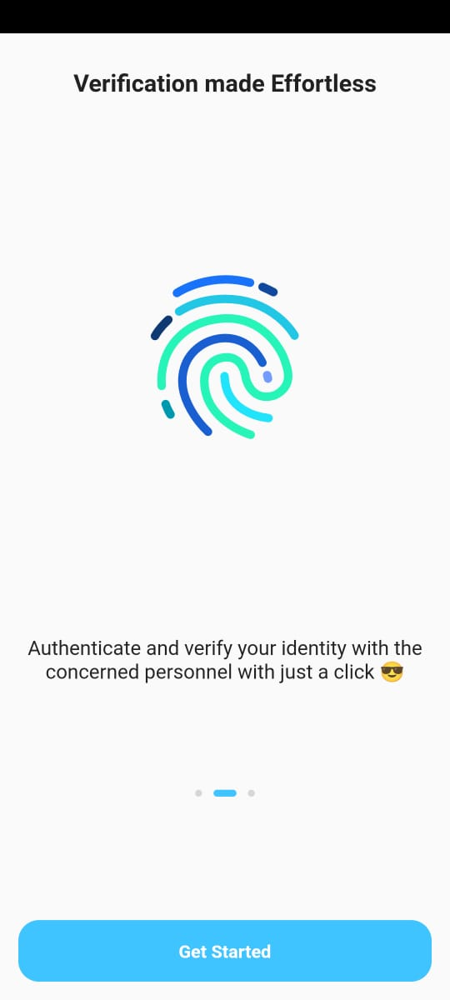
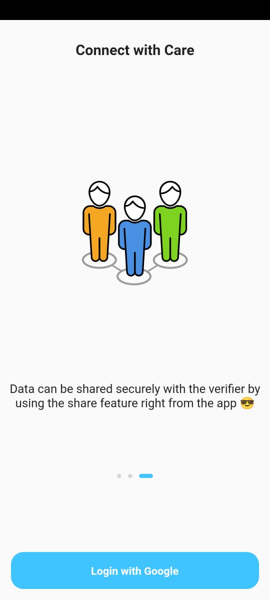
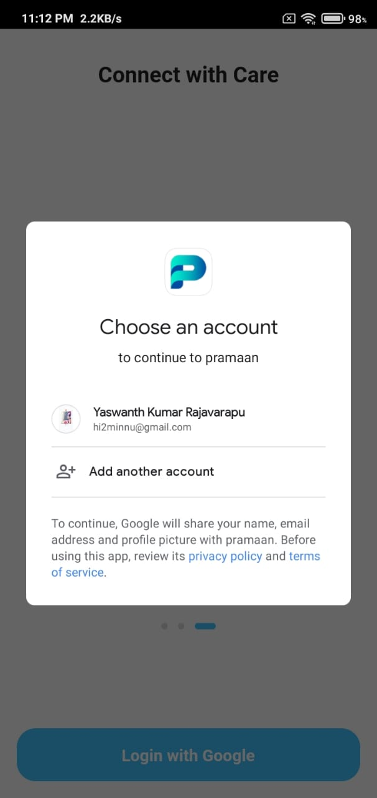
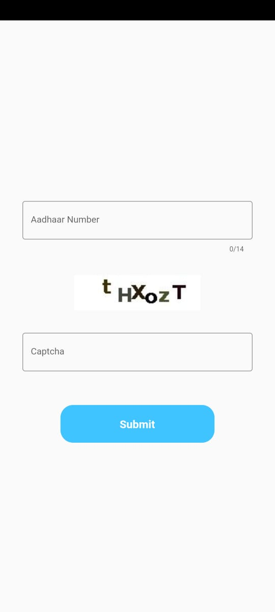
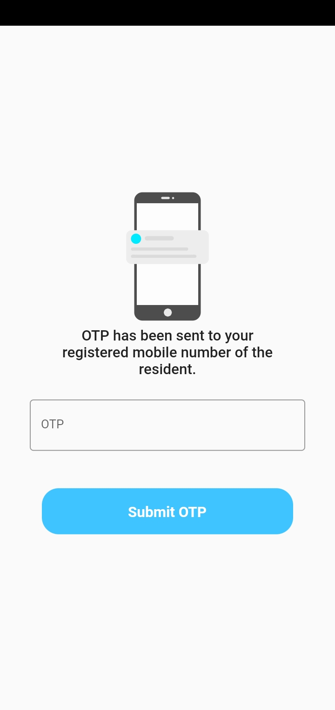
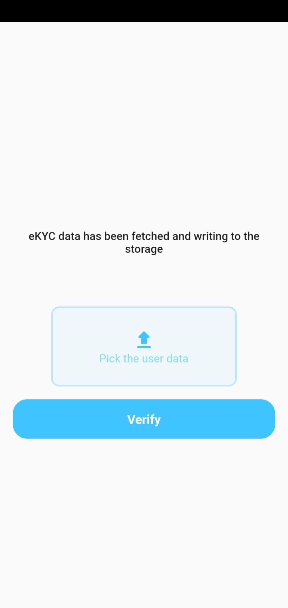
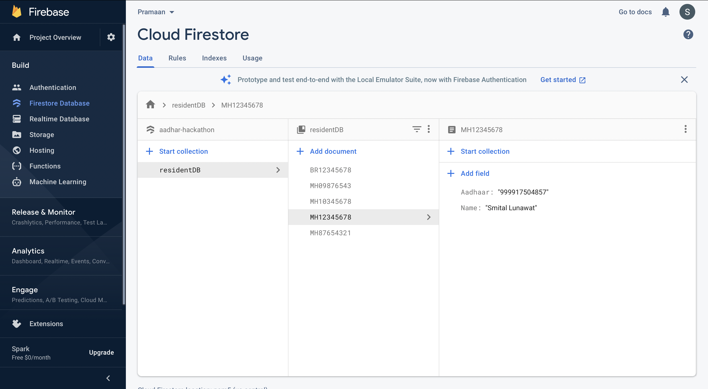

Theme 2 
Problem Statement 4

Application name :PRAMAAN (hindi translation of evidence)
you have a quick and easy identification at any place , any time.
Authenticate and verify your identity with the concerned personnel with just a click.
Securely share the document with the verifier by using the share feature right from the app.

Step1-Install Flutter

Step2-Flutter pub get

Step3-Flutter run

The Apk file can be found in `assets/flutter-apk` folder

Video Link for the Demo
https://drive.google.com/file/d/16F5aNyVpmO6PHpA6ztaWJJb-P7Zw4m6f/view?usp=sharing

